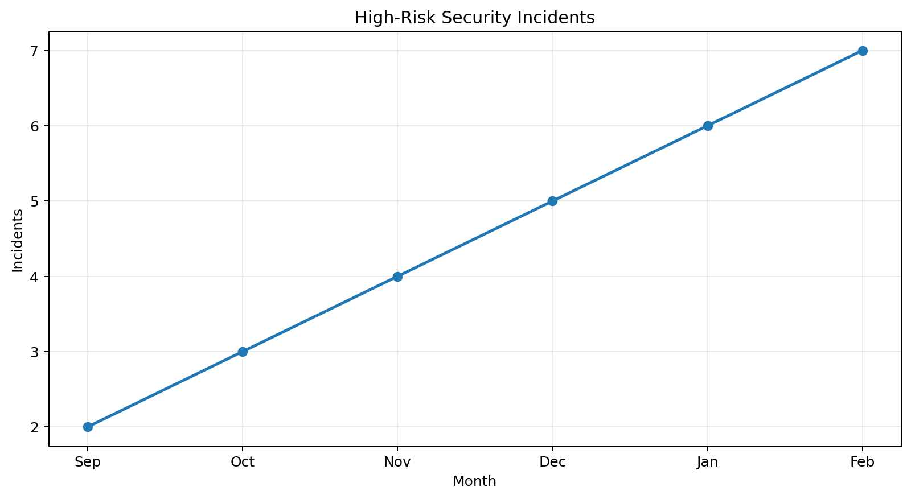
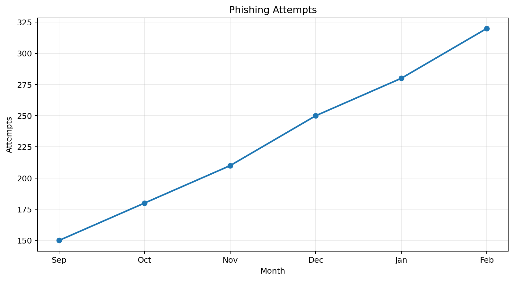
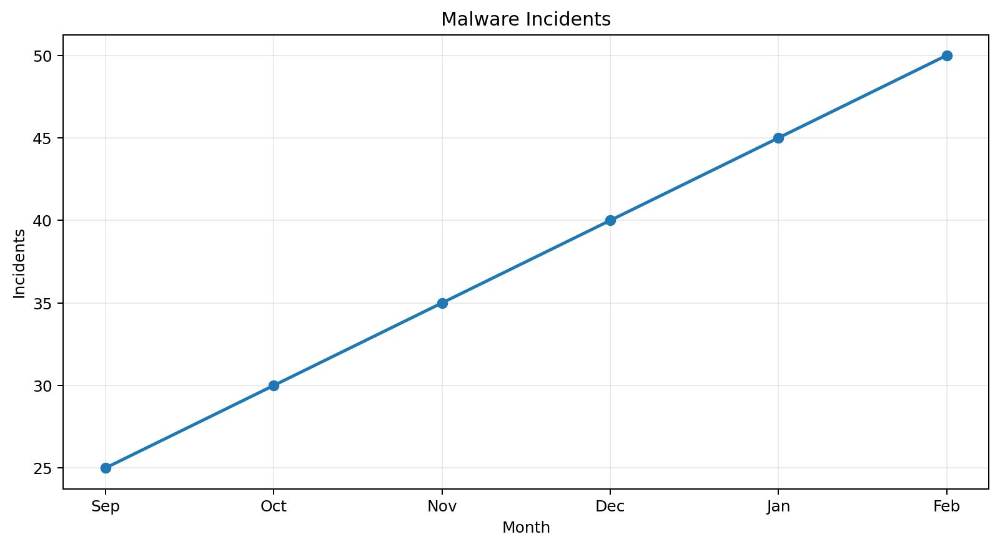
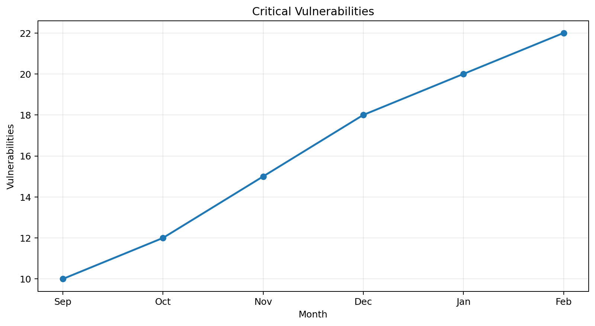
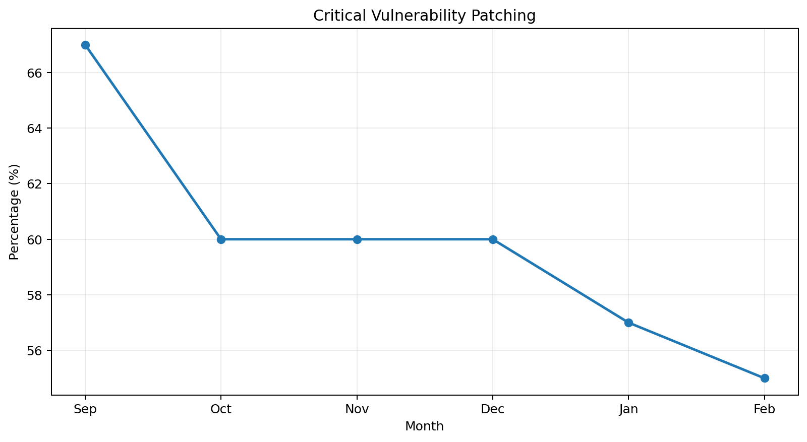
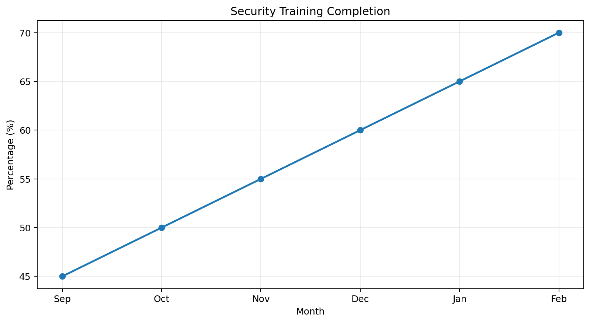

# GlobalHealth Connect — Security Dashboard

## Reporting Period
September 2025 – February 2026

## Dashboard Purpose

This dashboard provides a Board-level view of GlobalHealth Connect's security posture.

It translates security metrics into business risks and management actions.

The dashboard focuses on:

- Security incidents
- Phishing and malware activity
- Critical vulnerabilities
- Vulnerability remediation
- Security awareness

The analysis helps management identify negative trends, prioritise risks and support security decisions.

## Overall Security Posture

🔴 RED — Immediate Management Attention Required

Security risk increased during the reporting period.

- High-risk incidents increased from 2 to 7
- Phishing attempts increased from 150 to 320
- Malware incidents increased from 25 to 50
- Critical vulnerabilities increased from 10 to 22
- Patching performance declined from 67% to 55%
- Security training improved from 45% to 70%

---

## Key Security Metrics

| Metric | September | February | Trend | Status |
|---|---:|---:|---|---|
| Phishing Attempts | 150 | 320 | ↑ 113% | 🔴 Red |
| Malware Incidents | 25 | 50 | ↑ 100% | 🔴 Red |
| Critical Vulnerabilities | 10 | 22 | ↑ 120% | 🔴 Red |
| Critical Vulnerability Patching | 67% | 55% | ↓ 12% | 🔴 Red |
| Security Training Completion | 45% | 70% | ↑ 25% | 🟢 Green |
| High-Risk Security Incidents | 2 | 7 | ↑ 250% | 🔴 Red |

---

## Risk Trend

### High-Risk Incidents

2 → 7

The number of high-risk incidents increased significantly.

This indicates that the organisation needs stronger monitoring, incident response and executive oversight.

### Vulnerability Management

67% → 55% patching

Patching performance declined while the number of critical vulnerabilities increased.

This creates a growing exposure to security incidents.

### Security Awareness

45% → 70% training completion

Training completion improved.

However, the increase in phishing activity shows that training should also be measured for effectiveness, not only completion.

---

## Priority Risks

### Risk 1 — Increasing High-Risk Incidents

Risk: High-risk incidents increased from 2 to 7.

Business impact:
- Increased risk to patient information
- Potential regulatory consequences
- Possible financial losses
- Damage to customer trust

Recommended action:
Strengthen incident detection and response and establish clear escalation thresholds for senior management.

---

### Risk 2 — Declining Vulnerability Patching

Risk: Critical vulnerability patching declined from 67% to 55%.

Business impact:
- Increased exposure to exploitation
- Greater likelihood of service disruption
- Increased risk to sensitive information

Recommended action:
Introduce risk-based patching deadlines and report overdue critical vulnerabilities to the Security Steering Committee.

---

## Management Recommendations

1. Strengthen security monitoring and incident response.
2. Introduce clear remediation deadlines for critical vulnerabilities.
3. Continue security awareness training.
4. Measure whether training reduces phishing risk.
5. Provide regular security risk reporting to senior management and the Board.

---

## Board-Level Conclusion

GlobalHealth Connect's security posture requires immediate management attention.

Although security training has improved, the overall risk position has worsened because security incidents and critical vulnerabilities are increasing while patching performance is declining.

Management should prioritise vulnerability remediation, incident response and continuous security monitoring.

---

# Visual Security Trends

## High-Risk Security Incidents

## Phishing Attempts

## Malware Incidents

## Critical Vulnerabilities

## Critical Vulnerability Patching

## Security Training Completion

